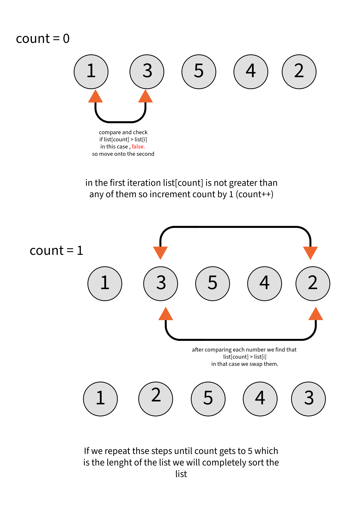
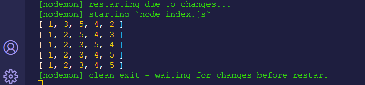

### Selection Sort Algorithm Implementation in JavaScript
- This repository contains a JavaScript implementation of the selection sort algorithm. The selection sort is a simple sorting algorithm that repeatedly selects the smallest (or largest, depending on sorting order) element from the unsorted portion of the list and places it at the beginning.

## Code Structure
- list: An array containing a list of elements to be sorted [1, 3, 5, 4, 2].
- count: A variable used to count the number of iterations in the sorting process.
- temp: A temporary variable used for swapping elements during sorting.
- selection: Represents the current element selected for comparison, initialized with the element at index 0 in the list.

## Sorting Process
- The code utilizes a nested loop structure to perform the selection sort:
- Outer Loop (while): Executes until count reaches the length of the list.

- Increment count after each iteration.
- Inner Loop (for): Loops through the elements from count to the end of the list.

- Compares the element at index count with subsequent elements (list[i]).
- If an element smaller than the current list[count] is found, it swaps them.

## Sorting Output
- The console logs the state of the list after each iteration to showcase the sorting process.

## Running the Code
- To test the selection sort algorithm, copy and paste the provided JavaScript code into a JavaScript environment (e.g., a Node.js environment or a browser's JavaScript console) and execute it.

